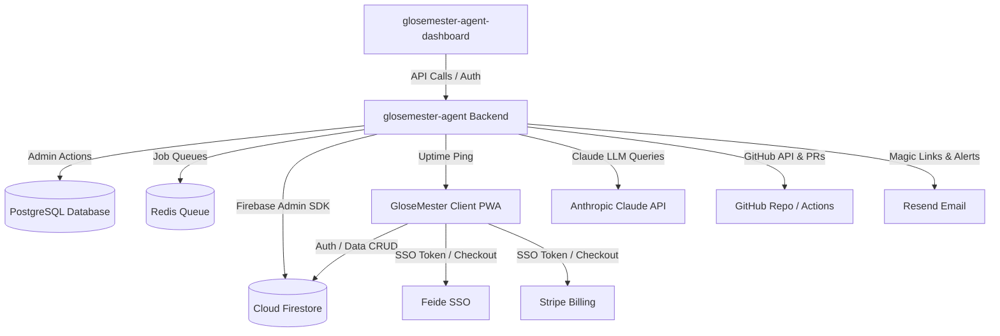

# Findings & Decisions: Project Research

## Requirements
- Understand the architecture, design, and deployment of GloseMester-V0.1-Alpha, glosemester-agent, and glosemester-agent-dashboard.
- Map the "KOM_I_GANG" files to understand development phases.

## Research Findings

### GloseMester-V0.1-Alpha
- **Gamified vocabulary learning PWA** (Progressive Web App) for Norwegian schools and self-study.
- **Frontend Tech Stack**: Vanilla HTML, Vanilla JS (ES6 modules), Vanilla CSS (~2900 lines of CSS in `css/main.css`), Firebase Client SDK v9 (modular).
- **Codebase Structure**: Contains both a legacy `js/` directory (with older versions of `app.js`, features, and navigation) and a newer refactored `src/` directory which is used by `index.html` (e.g. `` and stylesheets in `src/styles/`).
- **SPA Entry Point (`src/app.js`)**:
  - Sets up global object `window.GloseMester` (`version: '2.6.0'`, `aktivtFag: 'gloser'`, `aktivRolle: null`, `bruker: null`, etc.).
  - Handles **Feide Callback** on app launch (`handleFeideCallback()`).
  - Registers routes on the client-side router (`/` -> `pages/landing.js`, `/gloser` -> `pages/fag-start.js`, `/lærer` -> `features/teacher/teacher-module.js` with login modal redirect, `/login` -> redirect to `/`, `/galleri` -> placeholder).
  - Handles **QR-code scan URL parameters** (`?prove=CODE`) to fetch and start quizzes instantly.
  - Registers Service Worker (`sw.js`) and initializes iOS-specific installation prompt popups.
- **Backend Tech Stack**: Netlify Functions (serverless Node.js), Firebase Admin SDK:
  - `admin-totp.js`: Admin TOTP MFA code generation/validation.
  - `feide-auth.js`: Feide OIDC login token exchange.
  - `school-inquiry.js`: Handles inquiries for school packages (using Resend).
  - `stripe-checkout.js`: Initializes Stripe Checkout session.
  - `stripe-webhook.js`: Receives Stripe checkout completion webhook to activate subscription in Firestore.
- **Database & Security (`firestore.rules`)**:
  - `isAdmin()` checking user role in Firestore `/users/{userId}`.
  - `/felles_prover/{testId}`: read for logged-in users if approved or admin, write for admin only.
  - `/glosebank/{glosebankId}`: read for `skolepakke` users and admin, write for admin only.
  - `/standardprover/{proveId}`: read for `premium`, `skolepakke` and admin.
  - `/users/{userId}`: read/write restricted to the user or admin.
  - `/prover/{proveId}`: read is public (for guests scanning QR code), write is for logged-in teachers.
  - `/trades/{tradeId}`: public read, create is restricted to pending status, write restricted to status in pending/accepted.
  - `/resultater/{resultatId}`: read for logged-in users, create is public, update/delete restricted to test owner or admin.
  - `/school_inquiries/{inquiryId}` and `/orders/{orderId}`: restricted to owner or admin.

- **Database**: Cloud Firestore (Collections: `users`, `prover`, `glosebank`, `orders`, `school_inquiries`) with role-based Firestore Security Rules.
- **Hosting**: Netlify (`glosemester.no`), auto-deployed via GitHub.
- **Auth**: Firebase Auth, OIDC Feide (SSO for Norwegian schools), Google OAuth, Email/Password.
- **Monetization**: Stripe payments (Checkout API + Webhook logic), with Free, Premium (99 kr/mo or 800 kr/yr), and School packages (5k-10k kr/yr).
- **Key Features**: 3 progressive levels, Leitner learning system for vocabulary repetition, audio support (Web Speech API), PWA offline support, card collection game (Common, Rare, Epic, Legendary card types), teacher dashboard with analytics/saved tests/GloseBank test library.
- **Version**: `v2.4.2-ALPHA` (as of March 6, 2026). Target launch is Q2 2026.

### glosemester-agent
- **Node.js (v22)** backend API and worker system.
- **Database Schema (`prisma/schema.prisma`)**:
  - `User`: Admin or Reviewer accounts. Relations to approved drafts, created/approved tasks, audit logs.
  - `Email`: Inbound and outbound support mail. Fields: subject, bodyText, bodyHtml, classification (`faq`, `bug_report`, `feature_req`, `sales`, `complaint`, `support`, `billing`, `other`), sentiment, confidence, status (`new`, `classified`, `drafted`, `sent`, `archived`, `failed`).
  - `EmailDraft`: Proposed replies generated by the AI agent. Linked to `Email`, approved by a `User`.
  - `AgentTask`: Developer task workflow. Source: `manual`, `email`, `monitor`, `scheduled`. Status: `planning`, `awaiting_approval`, `approved`, `coding`, `pr_open`, `testing`, `ready_for_merge`, `merged`, `failed`, `cancelled`. Tracks branch, PR URL, files changed, commit SHA, and test summary.
  - `ApiUsage`: Tracks token usage and costs for Anthropic Claude queries. Links to `AgentTask` or `Email`.
  - `AuditLog`: Logs actions, actors, IP addresses, and details for auditing.
  - `AgentConfig`: Dynamic JSON configuration for individual agents (e.g. email, developer).
  - `HealthCheck`: Uptime check logs for `https://glosemester.no` (statusCode, responseTimeMs, success, errorMessage).
  - `Campaign` & `CampaignAsset`: Managed social media marketing campaign scripts and video/image file references.
- **Background Tasks**: Redis-backed queue system managed by PM2, running 5 processes:
  1. `glosemester-api` (Express backend serving `/api` and webhooks)
  2. `glosemester-email-worker` (Handles email sending using Resend API - run dev task: `npm run dev:worker:email`)
     - Flow: Reads incoming email, queries Claude for classification (FAQ, Bug, Feature, Support, etc.) and sentiment analysis, drafts a reply in Norwegian, and stores the draft for human approval in the dashboard.
  3. `glosemester-dev-worker` (Development agent helper - run dev task: `npm run dev:worker:dev`)
     - Flow: Processes developer tasks entered in dashboard. Claude details a plan, and upon human approval, Claude reads code from GitHub (via Octokit/GitHub API), implements changes/files, commits to a branch, and opens a Pull Request on repository `Glosemester-test`.
  4. `glosemester-monitor-worker` (Uptime monitor targeting `https://glosemester.no` at 5-minute intervals - run dev task: `npm run dev:worker:monitor`)
     - Flow: Pings the `MONITOR_TARGET_URL`. Results are logged in the `HealthCheck` table. If 3 consecutive checks fail, it creates an `AgentTask` in the dashboard and triggers an email alert. If the website recovers, it closes the task. It also supports dynamic toggling of agent execution status from the dashboard via the `AgentConfig` collection/table.
  5. `glosemester-campaign-worker` (Campaign sender/management - run dev task: `npm run dev:worker:campaign`)
     - Flow: Processes social media video creation campaigns (status flow: `draft` -> `generating` -> `screenshots` -> `building` -> `ready`).
     - Phase I (Social Media Agent & Screenshots): Claude designs a script and storyboard (pages to capture, captions, hashtags). Puppeteer is used to spin up a browser and capture screenshots at platform-specific resolutions (Instagram 1080x1080, TikTok 1080x1920, YouTube 1280x720, Facebook 1200x630). Screenshots are saved to disk (`./uploads/campaigns/{id}/screenshots/`).
     - Phase J (Video Building with ffmpeg): The worker runs ffmpeg to stitch the screenshots together into an MP4 video (3 seconds per slide) matching the platform format, ready for download at `/api/campaigns/:id/video`.
- **AI Integration**: Anthropic API (`claude-sonnet-4-5`) with daily and monthly USD cost caps.

- **Test-Agent (`glosemester-agent/KOM_I_GANG_FASE_G.md`)**:
  - Summarizes GitHub Actions test runs for PRs. It reads the test results and writes a 2-4 sentence Norwegian summary explaining what failed or succeeded. Can be triggered automatically by webhook (`/webhook/github` for `check_run` events using ngrok) or manually in the task detail page.
- **Consumption Tracking & Audit**:

  - Consumption Page (`/forbruk`): Tracks current day, last 7 days, and current month costs (mapped to NOK). Displays cost bar progress against daily/monthly USD limits and break-downs of API usage (token counts, costs) per agent.
  - Audit Page (`/audit`): Complete event history logging (email classification, draft choices, task execution, etc.) with paginated grid (25 items/page), actor indicators (Bot, Server, User), and extra JSON details.

- **Email**: Resend API for transactional emails/magic links.
- **GitHub Integration**: Syncs issues and webhooks (repo `Glosemester-test`).
- **Security**: JWT-based authentication for dashboard users.
- **Deployment**: Deployed on Ubuntu 24.04 VM (Hetzner CX22) behind Nginx proxy with Certbot SSL.

### glosemester-agent-dashboard
- **React + TypeScript + Vite** SPA.
- **Routing (`src/App.tsx`)**:
  - Uses `react-router-dom` for client routing and `@tanstack/react-query` (React Query) for API data caching and mutations.
  - `/login`: Dashboard login page.
  - `/auth/verify`: Verifies the magic link token.
  - Protected Routes (under `ProtectedRoute` and `Layout` containing sidebars/headers):
    - `/` -> `Inbox` page (list of inbound emails)
    - `/inbox/:id` -> `EmailDetail` page (reading email, AI draft reasoning/confidence, and draft editing/sending)
    - `/tasks` -> `Tasks` page (developer tasks list)
    - `/tasks/:id` -> `TaskDetail` page (task status flow, approved planner, PR branch details, automated test summary)
    - `/monitor` -> `Monitor` page (website uptime graphs, logs, and toggle configs for workers)
    - `/forbruk` -> `Usage` page (daily/monthly caps progress and token usage logs)
    - `/audit` -> `Audit` page (activity logs grid)
    - `/kampanjer` -> `Campaigns` page (list of campaigns, creation drawer)
    - `/kampanjer/:id` -> `CampaignDetail` page (5-step campaign progress, Claude script/storyboard, screenshots, MP4 download)
    - `/brukere` -> `GloseMesterBrukere` page (admin list and management of GloseMester's users).
- **GloseMester Users Management (`src/pages/GloseMesterBrukere.tsx`)**:
  - Allows search and detail editing of users.
  - Supports role mutation (`laerer`, `admin`, `elev`).
  - Supports subscription status mutation (`free`, `premium`, `skolepakke`).
  - Supports account enable/disable.
- **Deployment**: Static build (`dist/` directory) served directly by Nginx.
- **Routing**: API proxying configured in Nginx (`/api/` -> `localhost:3000`, `/webhook/` -> `localhost:3000`).
- **Features**: Interface for inbox, developer agent, monitor status, billing/usage consumption, and audit logs. Login works via email magic links.

## System Architecture & Integration Synthesis

### 1. Repository Relationships & Communication
The overall system consists of three main components:
- **GloseMester (Client PWA)**: The gamified student practice application and teacher test creator. It runs as a client-side SPA communicating directly with Google Firebase (Auth & Firestore) and Netlify serverless functions.
- **glosemester-agent (Backend & Queue System)**: A Fastify-based backend running Node 22, backed by PostgreSQL, Redis (via BullMQ), Puppeteer, and ffmpeg. It powers background AI workers that automate support e-mails, software development tasks, site monitoring, and marketing video creation.
- **glosemester-agent-dashboard (Admin Console)**: A React/TypeScript/Vite-based dark-themed SPA used by admins to monitor email drafts, run the developer agent, check uptime/consumption, and create marketing campaigns. It talks to the agent backend over local/proxied HTTP API endpoints.

---

### 2. The 11 Development Phases (KOM_I_GANG A-K)

| Phase | Title | Description / Functionality | Location |
|-------|-------|-----------------------------|----------|
| **Fase A** | Backend-skjelett | Fastify server, Prisma-managed Postgres schema, Redis setup, JWT / magic link authentication. | `glosemester-agent` |
| **Fase B** | Dashboard-skjelett | Dark-themed dashboard base layout, React Router, JWT validation, sidebar navigation. | `dashboard` |
| **Fase C** | E-postagenten | Reads support emails, classifies via Claude (`faq`, `bug_report`, `feature_req`, etc.), and drafts Norwegian replies. | `glosemester-agent` |
| **Fase D** | Utvikleragenten | Planning and code generation. Reads code, commits changes, and opens a GitHub Pull Request. | `glosemester-agent` |
| **Fase E** | Forbruk og Audit | Dashboard screens for consumption tracking (USD -> NOK, caps) and paginated system audit logs. | `dashboard` |
| **Fase F** | Monitor-agenten | Uptime checking worker pinging the client app. Alerts user and files task on 3 consecutive failures. | `glosemester-agent` |
| **Fase G** | Test-agenten | Fetches GitHub Action run reports and generates a concise, non-technical test summary on PRs. | `glosemester-agent` |
| **Fase H** | Kampanje-database | Schema migration and API routes (`/api/campaigns`) to manage marketing campaigns. | `glosemester-agent` |
| **Fase I** | Social Media Screenshots | Puppeteer automatically captures platform-appropriate screenshots (Instagram, TikTok, YouTube). | `glosemester-agent` |
| **Fase J** | Videobygging | Worker executes `ffmpeg` to assemble screenshot slide sequences into MP4 video outputs. | `glosemester-agent` |
| **Fase K** | Kampanje-dashboard | Front-end interface to configure campaigns, track worker stages, and download the finished MP4. | `dashboard` |

---

### 3. Service Configurations

- **Databases**:
  - **Firebase Firestore**: Dynamic user levels, vocabularies, standard/custom tests, student test results, and anonymous card trading.
  - **PostgreSQL**: Internal worker data, support email records, AI drafts, task execution tracking, API metrics/cost tracking, audit trail logs, uptime checks, and marketing campaign storyboards.
- **AI Engine**: Anthropic Claude API (`claude-sonnet-4-5`). Trapped within safety buffers (daily/monthly cost limits in USD).
- **Communication & SSO**: Feide OIDC integration for student/teacher SSO, Stripe API checkout sessions/webhooks, Resend API for email delivery, and Octokit for GitHub interaction.
- **Automation Utilities**: Headless Puppeteer for rendering and capturing screenshots, `ffmpeg` CLI binary for video encoding.

## Technical Decisions
| Decision | Rationale |
|----------|-----------|
| Use `/home/oyvind/Apper/GloseMester-V0.1-Alpha` as the home base for planning files | It is the primary project workspace containing the agent skills. |

## Issues Encountered
| Issue | Resolution |
|-------|------------|
| None  |            |

## Resources
- GloseMester App Website: https://glosemester.no
- Local Dashboard Server: http://localhost:5173
- Local Backend API: http://localhost:3000
- Prisma Studio Viewer: http://localhost:5555
- Hetzner Production Deployment Guide: [DEPLOY_HETZNER.md](file:///home/oyvind/Apper/glosemester-agent/DEPLOY_HETZNER.md)

## Questions for the Other Developer

### 1. Server & SSH Access
- [ ] What is the Hetzner server's public IP address?
- [ ] What SSH key should be used for connection (e.g. is the key stored locally in `~/.ssh/hetzner`, or is it linked to a specific user on this machine)?
- [ ] Are we using SSH port forwarding, or does the dashboard directly request the domain at `/api/` over HTTPS?

### 2. API Keys & Production Configs
- [ ] Where is the production `.env` file kept (or is it managed directly via system variables/PM2 env)?
- [ ] What Anthropic API key/model limit is currently active?
- [ ] Are the Resend credentials configured for production, and is the domain verified to send emails from `support@glosemester.no`?
- [ ] Is Stripe configured in live mode, and where is the webhook secret stored on the server?
- [ ] What GITHUB_TOKEN is used for code changes and PR creation? Does it write to GloseMester's main repository or to `Glosemester-test`?
- [ ] Firebase credentials: Is `firebase-service-account.json` loaded at `/opt/glosemester-agent/firebase-service-account.json`? Who has access to download/regenerate this key?

### 3. Databases & Upload Storage
- [ ] Are we using Docker container databases on the production Hetzner VM for PostgreSQL and Redis, or are they installed native?
- [ ] Is there an automated database backup strategy for PostgreSQL?
- [ ] When the Puppeteer campaign agent builds videos, screenshots are saved in `uploads/`. Are these backed up, or are they transient assets that can be deleted?

### 4. iOS / Android Native Wrap Plan
- **Platform Strategy**: Wrap the existing PWA using **Capacitor** to leverage the HTML/JS codebase.
- **Hardware Constraint**: User does not own a Mac. iOS builds (`.ipa`) must be generated using Cloud CI/CD pipelines (e.g., GitHub Actions macOS runners or Ionic Appflow).
- **Authentication**:
  - Feide SSO (OIDC redirect using secure app browser views like SFSafariViewController / Chrome Custom Tabs).
  - Google Sign-In.
  - Email/Password login.
- **Monetization (In-App Purchases)**:
  - Must use native Apple App Store Billing & Google Play Billing for subscription tiers.
  - **RevenueCat** is highly recommended to bridge the native IAP and Firestore database.
- **Native Features Required**:
  - Push Notifications.
  - Local Notifications.
  - Offline local storage (Capacitor Preferences or SQLite).
  - Native Text-to-Speech (TTS) engine to bypass Web Speech API limits.

